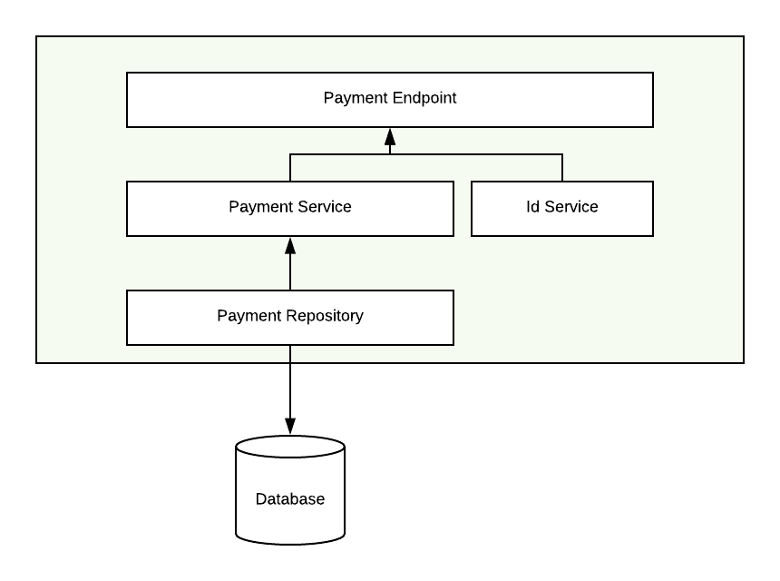

# Form3 Payment System

This project is composed by 2 modules:
 * service - contains the service code;
 * functional-tests - contains the service functional tests;
 
## Service Module
This service module was developed using Java + Spring Boot technologies.
This choice allowed the service to be developed must faster since since
we could leverage all Spring tools and pre-configurations.

This module can be splited into 3 parts:
 * domain - contains the domain model;
 * endpoints - REST endpoints plus the DTOs needed to perform the calls;
 * services - contains the repository and services needed.

  

This clean separation allow us to evolve the domain model in isolation (without changing the REST endpoints or 
REST contracts).

Because services do evolve and contracts do change, a class
was created (PaymentDataMapper) to adapt the Input/Output models and the domain
model.

Also, the main components of this service where unit tested in isolation,
meaning that all classes where tested against mocks/stubs.

### Rest Documentation
The swagger documentation can be found inside the 
*service/src/main/resources/swagger.yaml*

## Functional Tests
This module contains all necessary classes to run the functional tests.
It was developed thinking that some functional tests can be reused also as
integration tests. Therefore, it should be possible to run them
when the service gets deployed to a It or Preprod environment.

## Deployment
This service should be deployed/delivered as a Docker container. Because of that,
all Functional tests are running against a docker container.
